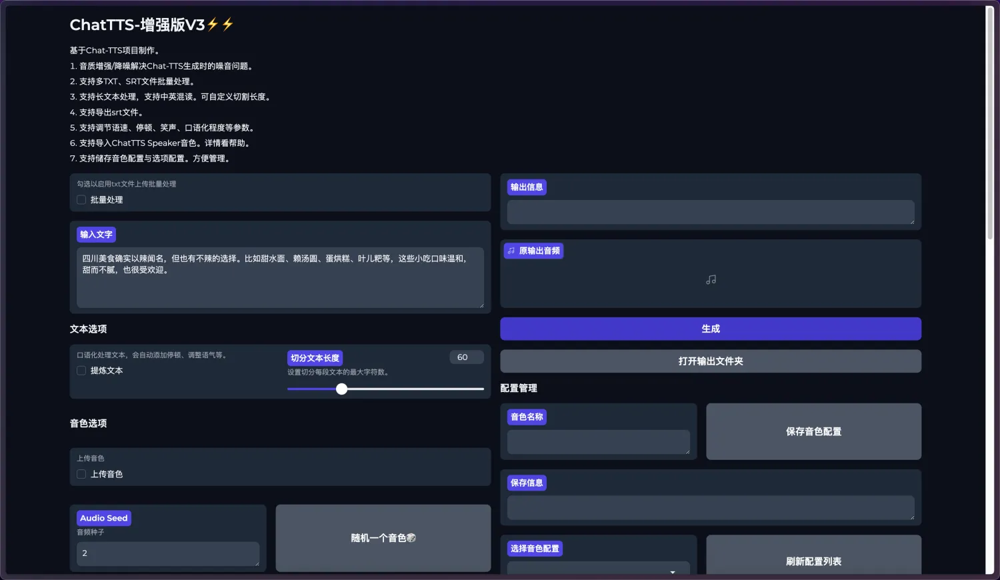

# ChatTTS-Enhanced
## 项目预览

## 介绍

- 音质增强/降噪解决Chat-TTS生成时的噪音问题。 
- 支持多TXT、SRT文件批量处理。 
- 支持长文本处理，支持中英混读。可自定义切割长度。 
- 支持导出srt文件。
- 支持调节语速、停顿、笑声、口语化程度等参数。
- 支持导入ChatTTS Speaker音色。详情看帮助。
- 支持储存音色配置与选项配置。方便管理。


## 离线一键整合包
支持WIN、MAC

百度网盘

链接: https://pan.baidu.com/s/1DqvN2hHZ2uAmdjKCwKNmCQ?pwd=f5d4 提取码: f5d4

夸克网盘

链接：https://pan.quark.cn/s/4ee64af2aedb
## 部署
### Windows
```
conda create -n Dlab python=3.10
conda activate Dlab
conda install pytorch==2.1.1 torchvision==0.16.1 torchaudio==2.1.1 pytorch-cuda=11.8 -c pytorch -c nvidia
```

```
pip install resemble-enhance --no-deps
```

[https://github.com/erew123/alltalk_tts/releases/tag/deepspeed](https://github.com/erew123/alltalk_tts/releases/tag/deepspeed)
```
pip install deepspeed-0.11.2+cuda118-cp310-cp310-win_amd64.whl
```

```
pip install -r requirements.txt
```

```
conda install -c conda-forge pynini==2.1.5
```

```
pip install WeTextProcessing
```

```
python webui/webui.py
```
### Mac&Linux部署
```
conda create -n Dlab python=3.10
conda activate Dlab
```

Linux
```
conda install pytorch==2.1.1 torchvision==0.16.1 torchaudio==2.1.1 pytorch-cuda=11.8 -c pytorch -c nvidia
```
Mac
```
conda install pytorch==2.1.1 torchvision==0.16.1 torchaudio==2.1.1 cpuonly -c pytorch
```

```
pip install resemble-enhance
pip install -r requirements.txt
pip install WeTextProcessing
```
```
python webui/webui.py
```


## 感谢

- ChatTTS:https://github.com/2noise/ChatTTS
- Resemble Enhance:https://github.com/resemble-ai/resemble-enhance
- ChatTTS_colab:https://github.com/6drf21e/ChatTTS_colab
- PaddleSpeech:https://github.com/PaddlePaddle/PaddleSpeech
- ChatTTS_Speaker:https://github.com/6drf21e/ChatTTS_Speaker
- WeTextProcessing:https://github.com/wenet-e2e/WeTextProcessing


